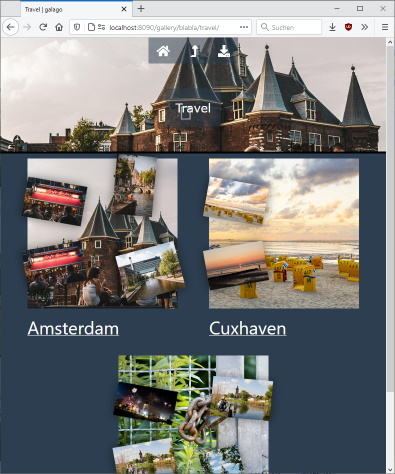
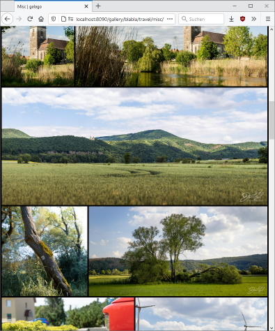

# Galago

`Gallery + Go = Galago`

Galago is an easy to set up web gallery which focuses on its main purpose: to show pictures.

## Features

- File system based: Throw a bunch of pictures into folders to make them available to other people
- No user management: Visitors can view and download images, nothing more
- Download function for single images or albums
- Responsive layout that makes use of the whole screen on any device
- Lazy loading of images
- Automatic image rescaling and caching
- No external dependencies

